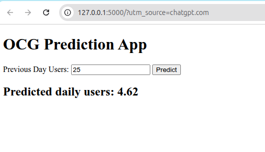

# 🚀 OCG Daily User Prediction ETL + ML Pipeline

A miniature ETL pipeline and prediction service built for APHRC's coding challenge.

## 📊 What It Does

- Loads and processes user activity logs (JSON)
- Aggregates daily active users
- Trains a regression model (Linear Regression) to predict daily usage
- Exposes a `/predict` API endpoint using FastAPI
- Includes a simple web frontend to test predictions interactively

---

## 📂 Project Structure

etl_aphrc/
├── main.py # ETL + model training pipeline
├── api.py # FastAPI web server for predictions
├── model.pkl # Serialized trained model
├── activity_logs.json # Synthetic activity log data
├── static/
│ ├── index.html # Frontend UI
│ └── screenshot_ui.png # Screenshot of UI (used below)
├── requirements.txt
└── Dockerfile


---

## 🌐 Web App Screenshot



---

## 🔧 How to Run Locally

### 1. Clone and set up environment

```bash
git clone https://github.com/YOUR_USERNAME/etl_aphrc.git
cd etl_aphrc
python3 -m venv venv
source venv/bin/activate
pip install -r requirements.txt

### 2. Run the pipeline
python main.py

### 3. Start the web API
uvicorn api:app --reload --port 5000


---

## ✅ Step 3: `Dockerfile`

Here’s a lightweight and working Dockerfile:

```dockerfile
# Use official Python base image
FROM python:3.12-slim

# Set working directory
WORKDIR /app

# Copy project files
COPY . .

# Install dependencies
RUN pip install --upgrade pip && pip install -r requirements.txt

# Expose port
EXPOSE 5000

# Run the app
CMD ["uvicorn", "api:app", "--host", "0.0.0.0", "--port", "5000"]
